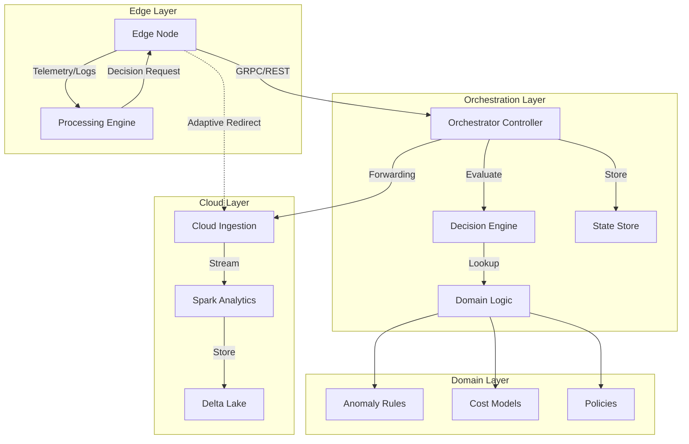

# System Architecture

The Adaptive Orchestrator dynamically balances processing workloads between Edge nodes and the Cloud based on real-time metrics, cost models, and anomaly detection.

## Responsibility Boundaries

- **Edge Layer**: Local ingestion, validation, and near-real-time inference.
- **Orchestration Layer**: Coordination of processing modes and centralized state management.
- **Cloud Layer**: Long-term storage, complex analytics, and global model training.
- **Domain Layer**: Pure business rules isolated from infrastructure concerns.
